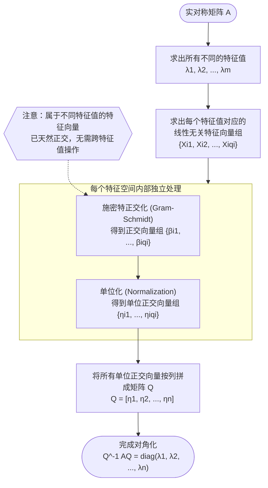

## 一、实对称矩阵的特征值和特征向量

### 复矩阵的运算

> [!NOTE]
> 接下来这一小节所有的讨论均在复数域进行。

设 $A = [a_{ij}]$，$\bar{A} = [\bar{a}_{ij}]$（共轭矩阵）：

1. $\overline{\bar{A}} = A$
2. $\overline{kA} = \bar{k} \bar{A}$
3. $\overline{A+B} = \bar{A} + \bar{B}$
4. $\overline{AB} = \bar{A} \bar{B}$
5. $(\overline{AB})^T = \bar{B}^T \bar{A}^T$
6. 若 $A$ 可逆，$\overline{A^{-1}} A = \bar{I} = I = 1 \Rightarrow \overline{A^{-1}} = (\bar{A})^{-1}$
7. $\det(\bar{A}) = \overline{\det(A)}$
8. $r(\bar{A}) = r(A)$

**推论：**
设 $X = (x_1, x_2, \dots, x_n)^T$，则 $\bar{X}^T X = \sum_{i=1}^n \bar{x}_i x_i \ge 0$，当且仅当 $x_i = 0$ 时 $\bar{X}^T X = 0$。

### **定理 5.3.1**

实对称矩阵特征值都是实数。

**证明：**
设 $AX_0 = \lambda_0 X_0$。
对等式两边同时取转置与共轭：
$(\overline{AX_0})^T = \bar{\lambda}_0 \bar{X}_0^T$
$\bar{X}_0^T \bar{A}^T = \bar{X}_0^T A = \bar{\lambda}_0 \bar{X}_0^T$（注：实对称矩阵满足 $\bar{A}^T = A$）
$\Rightarrow \bar{X}_0^T A X_0 = \bar{\lambda}_0 \bar{X}_0^T X_0$
$\Rightarrow \bar{X}_0^T (\lambda_0 X_0) = \bar{\lambda}_0 \bar{X}_0^T X_0$
$\Rightarrow (\lambda_0 - \bar{\lambda}_0) \bar{X}_0^T X_0 = 0$
$\because \bar{X}_0^T X_0 \ge 0$，且由于 $X_0 \neq \theta$，故 $\bar{X}_0^T X_0 > 0$。
$\therefore \lambda_0 - \bar{\lambda}_0 = 0$，即 $\lambda_0 = \bar{\lambda}_0$。
$\therefore \lambda_0 \in \mathbb{R}$。

### **定义 5.3.1**

- **实对称矩阵 $A$**：满足 $A^T = A$ 且 $\bar{A} = A$。
- **Hermite 矩阵**：满足 $\bar{A}^T = A$。实对称矩阵是其一个特例。
- **例：** $\begin{bmatrix} 1 & 1+i \\ 1-i & 2 \end{bmatrix}$ 是 Hermite 矩阵但不是实对称矩阵。

### **定理 5.3.2**

实对称矩阵属于不同特征值的特征向量组是正交的。

## 二、实对称矩阵的相似对角化

### **定理 5.3.3**

实对称矩阵任意特征值的代数重数与几何重数相等。

**推论：**
任何一个实对称矩阵都可以被对角化。

### **定理 5.3.4（最重要的两个定理之二）：**

对于任何一个 $n$ 阶实对称矩阵 $A$，存在 $n$ 阶正交矩阵 $Q$，使得：
$$Q^{-1}AQ = \text{diag}(\lambda_1, \lambda_2, \dots, \lambda_n)$$

**例：**
设 $A$ 是 $n$ 阶实对称矩阵且 $A^2 = A$。
证明：存在 $n$ 阶正交矩阵 $Q$ 使

$$
Q^{-1}AQ = \begin{bmatrix} 1 & & & \\ & \ddots & & \\ & & 1 & \\ & & & 0 \end{bmatrix}
$$

==即说明 $A$ 的特征值要么是 1，要么是 0==。

**证：**
由 $A^2 = A$ 可知

$$
A^2 - A = 0.
$$

记多项式 $f(x) = x^2 - x$，则

$$
f(A) = A^2 - A = 0.
$$

设 $\lambda$ 为 $A$ 的任意一个特征值，则 $f(\lambda)$ 为矩阵 $f(A)$ 的特征值。
因为 $f(A) = 0$（零矩阵），其所有特征值均为 $0$，故

$$
f(\lambda) = \lambda^2 - \lambda = 0 \quad \Rightarrow \quad \lambda(\lambda - 1) = 0.
$$

因此，

$$
\lambda = \quad \text{或} \quad \lambda = 1.
$$

又因 $A$ 是实对称矩阵，必可对角化，其相似对角矩阵的对角线元素即为其特征值，故这些元素只能是 $0$ 或 $1$。
